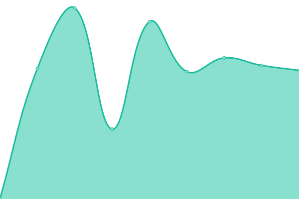
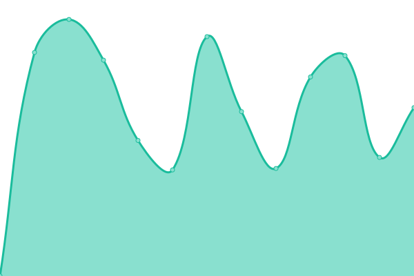
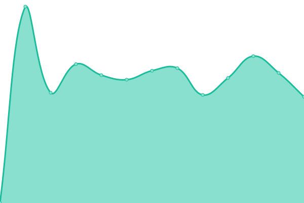

# [📈 Live Status](https://status.networkerd.cl): <!--live status--> **🟧 Partial outage**

This repository contains the open-source uptime monitor and status page for [J .](https://networkerd.cl), powered by [Upptime](https://github.com/upptime/upptime).

With [Upptime](https://upptime.js.org), you can get your own unlimited and free uptime monitor and status page, powered entirely by a GitHub repository. We use [Issues](https://github.com/thejoker-dev/upptime/issues) as incident reports, [Actions](https://github.com/thejoker-dev/upptime/actions) as uptime monitors, and [Pages](https://status.networkerd.cl) for the status page.

<!--start: status pages-->
<!-- This summary is generated by Upptime (https://github.com/upptime/upptime) -->
<!-- Do not edit this manually, your changes will be overwritten -->
<!-- prettier-ignore -->
| URL | Status | History | Response Time | Uptime |
| --- | ------ | ------- | ------------- | ------ |
|  [Networkerd.cl](https://networkerd.cl) | 🟥 Down | [networkerd-cl.yml](https://github.com/thejoker-dev/upptime/commits/HEAD/history/networkerd-cl.yml) | 

 166ms
     
 | 

<a href="https://status.networkerd.cl/history/networkerd-cl">0.00%</a>
    

|  [Savethedate.cl](https://www.savethedate.cl) | 🟩 Up | [savethedate-cl.yml](https://github.com/thejoker-dev/upptime/commits/HEAD/history/savethedate-cl.yml) | 

 315ms
     
 | 

<a href="https://status.networkerd.cl/history/savethedate-cl">100.00%</a>
    

|  [Pollosro.cl](https://www.pollosro.cl) | 🟩 Up | [pollosro-cl.yml](https://github.com/thejoker-dev/upptime/commits/HEAD/history/pollosro-cl.yml) | 

 839ms
     
 | 

<a href="https://status.networkerd.cl/history/pollosro-cl">100.00%</a>
    

|  [Maoristore.cl](https://maoristore.cl) | 🟩 Up | [maoristore-cl.yml](https://github.com/thejoker-dev/upptime/commits/HEAD/history/maoristore-cl.yml) | 

 2814ms
     
 | 

<a href="https://status.networkerd.cl/history/maoristore-cl">100.00%</a>
    

|  [Muyvesta.com](https://maoristore.cl) | 🟩 Up | [muyvesta-com.yml](https://github.com/thejoker-dev/upptime/commits/HEAD/history/muyvesta-com.yml) | 

 2836ms
     
 | 

<a href="https://status.networkerd.cl/history/muyvesta-com">100.00%</a>
    

|  [Technasis.cl](https://www.technasis.cl) | 🟥 Down | [technasis-cl.yml](https://github.com/thejoker-dev/upptime/commits/HEAD/history/technasis-cl.yml) | 

 0ms
     
 | 

<a href="https://status.networkerd.cl/history/technasis-cl">0.00%</a>
    

|  [Luminbarber.cl](https://luminbarber.networkerd.cl) | 🟥 Down | [luminbarber-cl.yml](https://github.com/thejoker-dev/upptime/commits/HEAD/history/luminbarber-cl.yml) | 

 0ms
     
 | 

<a href="https://status.networkerd.cl/history/luminbarber-cl">0.00%</a>
    

<!--end: status pages-->

[**Visit our status website →**](https://status.networkerd.cl)

## 📄 License

- Powered by: [Upptime](https://github.com/upptime/upptime)
- Code: [MIT](./LICENSE) © [J .](https://networkerd.cl)
- Data in the `./history` directory: [Open Database License](https://opendatacommons.org/licenses/odbl/1-0/)
